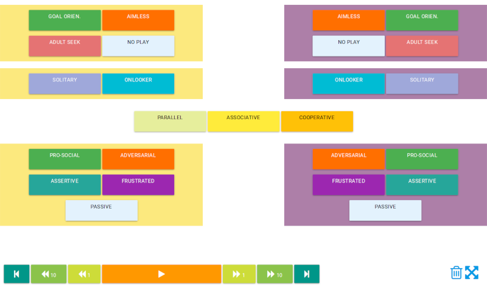

Free-play Sandbox -- Dataset Annotation GUI
===========================================

*This is one of the sister repository of
the 'Free-play Sandbox' experimental framework for Cognitive Human-Robot
Interaction research.*


Installation
------------

This software has only been tested on Ubuntu Linux.
Due to the reliance on ROS (specifically, [ROS Bags](http://wiki.ros.org/rosbag)
to store the data), **Windows is not (and can not be easily) supported**.

If not yet installed, start by [installing
ROS](http://wiki.ros.org/ROS/Installation) (tested with ROS Kinetic, but
other versions might work as well). You want to install `ros-kinetic-desktop` or
`ros-kinetic-desktop-full`.

Then, install the dependencies:
```
> sudo apt install ros-kinetic-audio-common-msgs libgstreamer.*1.0.*-dev
```

Then finally:

```
> git clone https://github.com/freeplay-sandbox/annotator.git
> cd annotator
> mkdir build && cd build
> cmake -DCMAKE_BUILD_TYPE=Release ..
```

Usage
-----

**From the directory containing the source**, execute
`build/freeplay-sandbox-annotator`. Select the bag file you want to annotate.

To create annotations, open the page `http://<ip of the computer running the
annotator>:8080` from another device (like a tablet). You should see the
following interface:



Annotations are automatically saved (cf status bar to see where they are saved).
