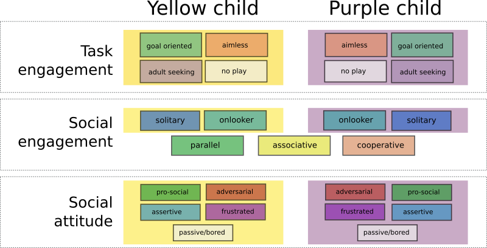

Free-play Sandbox -- Dataset Annotation GUI
===========================================

*This is one of the sister repository of
the 'Free-play Sandbox' experimental framework for Cognitive Human-Robot
Interaction research.*


Installation
------------

This software has only been tested on Ubuntu Linux.
Due to the reliance on ROS (specifically, [ROS Bags](http://wiki.ros.org/rosbag)
to store the data), **Windows is not (and can not be easily) supported**.

If not yet installed, start by [installing
ROS](http://wiki.ros.org/ROS/Installation) (tested with ROS Kinetic, but
other versions might work as well). You want to install `ros-kinetic-desktop` or
`ros-kinetic-desktop-full`.

Then, install the dependencies:
```
> sudo apt install ros-kinetic-audio-common-msgs libgstreamer.*1.0.*-dev
```

Then finally:

```
> git clone https://github.com/freeplay-sandbox/annotator.git
> cd annotator
> mkdir build && cd build
> cmake -DCMAKE_BUILD_TYPE=Release ..
```

Usage
-----

**From the directory containing the source**, execute
`build/freeplay-sandbox-annotator`. Select the bag file you want to annotate.

To create annotations, open the page `http://<ip of the computer running the
annotator>:8080` from another device (like a tablet). You should see the
following interface:


Annotations are automatically saved next to the bag file as `<bag
file>.annotations.yaml` (the status bar indicates the full path to this file).

### Keyboard shortcuts


- Press `Del` to clear all annotations.
- Press `Ctrl+S` to save the annotations to a different file.
- Press `Ctrl+O` to load annotations.
- Press `F11` to toggle fullscreen.

Coding scheme
-------------



We detail hereafter the coding scheme.

### Task Engagement

| Construct             | Details                                                                |
|-----------------------|------------------------------------------------------------------------|
| goal-oriented         | purposeful play, implicit action planning, structured play             |
| aimless               | unstructured play, silly play                                          |
| adult seeking         | ask question, seek approval                                            |
| no play               | does not perform any obvious activity                                  |

Note that *structured* play might or might no be be on topic: a structured
activity unrelated to the offered touchscreen/drawing activity should still be
labelled as *goal-oriented*.

### Social Engagement

| Construct             | Details                                                                       |
|-----------------------|-------------------------------------------------------------------------------|
| solitary play         |                                                                               |
| onlooker              | child looking at the other for a prolongated period of time, without engaging |
| parallel play         |                                                                               |
| associative play      |                                                                               |
| cooperative play      |                                                                               |

### Social attitude

| Construct             | Details                                                                   |
|-----------------------|---------------------------------------------------------------------------|
| pro-social            |                                                                           |
| adversarial           |                                                                           |
| assertive             |                                                                           |
| frustrated            |                                                                           |
| passive               |                                                                           | 


